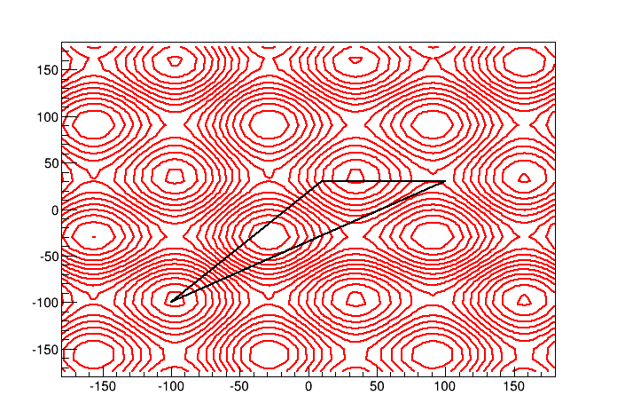

# Amoeba
## Summary
Minimization algorithms using the Nelder-Mead method, so-called amoeba, random scanning and simulated annealing.
The documentation can be found here: https://www.ge.infn.it/~chugon/Amoeba/html/

The examples on how to use each of the methods are in programs/test_*.cxx

## Description
The Nelder–Mead technique is a heuristic applied method to find out the minimum or maximum of an objective function in a multidimensional space (proposed by John Nelder & Roger Mead in 1965).
The method uses the concept of a simplex, which is a special polytope of n + 1 vertices in n dimensions. Examples of simplices include a line segment on a line, a triangle on a plane, a tetrahedron in three-dimensional space and so forth. This implementation accepts functions from 1 to any arbitrary dimensions. The processus is illustrated in the next figure. The strengh of this method is it's few steps to find the minimum, the weakness is it's tendency to find local minimums.

To have a probability to escape local minimums this implementation include a simple random scanning around the minimum leg of the amoeba. This scan is based on so-called noses that, at each step test a point around the minimum leg following a gaussian distribution with an arbitrary sigma. More than a method in itself, this naive approach prepares the next principal process.

The next step includes the simulated annealing method (Černý, V. (1985)) applied to the "lowest" leg of the amoeba. The process start with a temperature (this implementation propose an arbitrary initial temperature or an evolutive one following the minimums and maximums explored by the amoeba). At each step the temperature decreases. Bigger is the temperature, more probable the "nose" with higher value than the minimum leg replaces it. It keeps in memory the minimum it already met, so if it escapes from the true minimum, it will come back to it.

## Compilation:

Amoeba uses cmake. It has only the standard libraries (c++11) as dependency:

    mkdir build
    cd build
    cmake ..
    make

## Using it as external library
No installation script is done yet. To compile with it, just configure the environement variable AMOEBA_ROOT, then add

    -L${AMOEBA_ROOT}/build -lamoeba -I${AMOEBA_ROOT}/include/amoeba

in your compilation command. A script amoeba-config will be created soon to facilitate the linking.

##Application example
###Simple amoeba
This minimizer allows to find quickly a minimum, with a minimization of number of calculated points. The test_simple.cxx demonstrates how to use it for a function defined by:

    double value=-100*(exp(-((x_[0]*x_[0]-4))/7200)+exp(-((x_[1]*x_[1]+4))/7200)-sin (x_[0]/50)-sin(x_[1]/50));

as showed in the following picture, this function has multiple minimums. If the starts points of the amoeba is not too far enough in comparison of the minimum wells sizes, it has a good probability to do not fall inside. This example find the minimum in about 40 steps with a precision of 1°. This method is optimal for minimization from which we already have information and/or for prefit cases.

###Annealing and nosy amoeba
This, still under improvment, method uses first a random scan of the map with an arbitrary number of scanners (called noses). This scan can be homogeneous, or distributed with a normal distribution around the current minimum point.
The annealing uses the noses scans as a base to decide, in function of the current temperature, if a non smaller value is accepted or not. The example test_annealing.cxx shows how to use this method. The next figure shows the more complex used function, defined by

    double value=-100*(exp(-((x_[0]*x_[0]-4))/7200)+exp(-((x_[1]*x_[1]+4))/7200)-sin (x_[0]/20)-sin(x_[1]/20));

The simple amoeba is generally unable to find the real minimum and will tend to fall in a local minimum. The next figure shows the minimums found by the annealing, using the command

    ./test_annealing -n 2 -s 70 -minmax 0 400

The -n gives a number of noses, -s the sigma of the normal distribution around the current minimum and -minmax define the temperature differential we want to use in this case (400°, the annealing algorithm has been tuned in a way that the order of magnitude between the minimum and maximum is a good value). -s 70 is the order of magnitude of the x-y size minimum wells, optimizing the probability to escape from it. The next figure shows the probability to find the real minimum (-380) of to fall in other minimums.

As can be seen, the probability to find the wrong minimum is ~30%. Rerun a fair enough number of times the algorithm permit to reduce significantly this probability.
